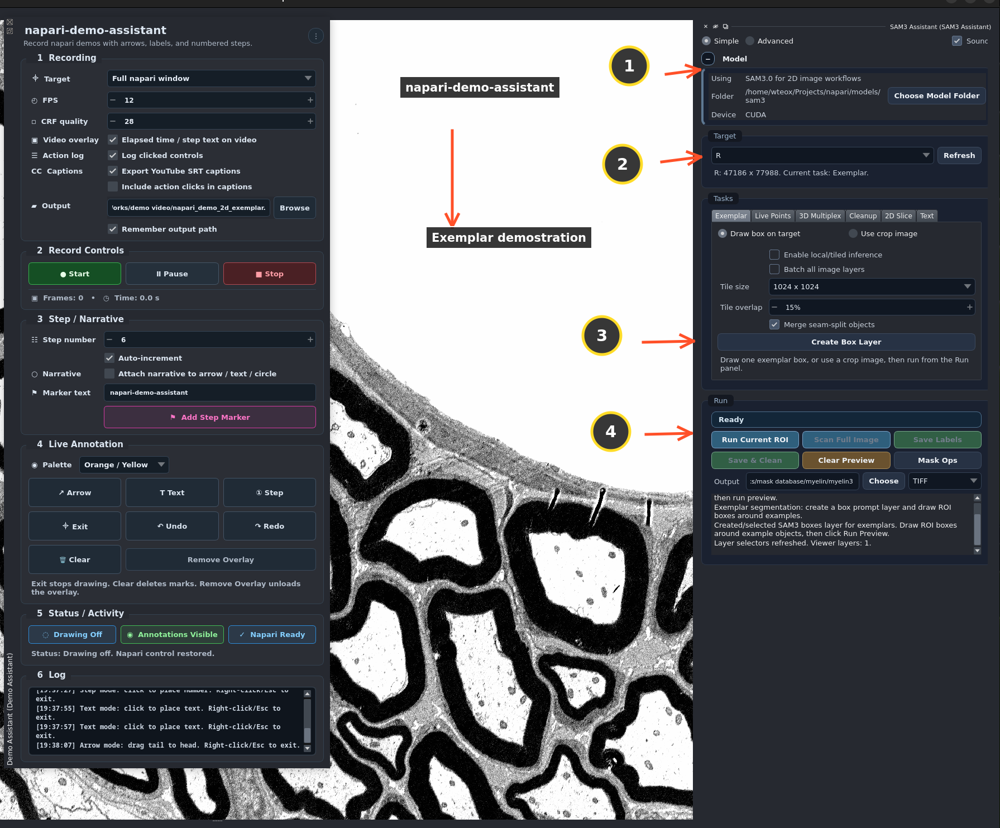

# napari-demo-assistant

`napari-demo-assistant` records short napari workflow videos with live visual cues, including arrows, numbered step circles, and optional labels.

It is designed for scientific-software demos, user support, GitHub issue feedback, tutorials, and plugin workflows such as `napari-sam3-assistant`.

Current release: `1.2.0`.



The plugin focuses on **demo recording**, not screenshot capture. Most operating systems already provide screenshot tools. The missing workflow is a simple napari-native way to record what happened and show users where to click.

## Key features

- Record the full napari window or only the viewer canvas.
- Export MP4 video with H.264 compression.
- Add arrows, text stamps, and numbered step circles while recording.
- Use high-contrast annotation color palettes.
- Attach optional narrative labels to annotations.
- Use a compact, icon-driven dock widget designed for napari.
- See drawing state, annotation visibility, napari control state, frame count, and elapsed time at a glance.
- Right-click or press `Esc` to exit drawing mode.
- Keep annotations visible after leaving drawing mode.
- Undo/redo annotations with buttons or `Ctrl+Z` / `Ctrl+Y`.
- Save timeline step markers beside the video as `.steps.json`.
- Optionally log clicked napari/plugin controls as an action trail beside the video.
- Export YouTube-friendly `.srt` captions beside the video.
- Remember the last output path and annotation color palette.

## Why this plugin exists

For interactive napari workflows, a short video is often clearer than written instructions. This is especially true for prompting, mask previews, label cleanup, layer switching, and plugin-specific controls.

Written documentation still matters, but UI changes make screenshots and step-by-step text expensive to maintain. A quick recording of the current napari workflow is often the fastest way to help users follow the correct steps.

`napari-demo-assistant` helps developers, imaging scientists, and support users record clear napari workflow videos with lightweight visual guidance. It is also useful for troubleshooting because users can show exactly what they clicked, what happened, and where an error appeared.

Commercial tools such as Snagit are useful, but they may not be available on Linux, remote workstations, or scientific Python environments. This plugin provides a focused napari-native alternative.

## Typical use cases

- Record short napari workflow tutorials for teaching, onboarding, or plugin documentation.
- Demonstrate plugin steps, button clicks, layer selection, and mask-cleanup actions.
- Create video replies for GitHub issues, user support, or collaborator feedback.
- Let users record bugs, unexpected behavior, or error messages so developers can see exactly what happened.

## Installation

### From PyPI

```bash
pip install napari-demo-assistant
```

### Development install

From the repository root:

```bash
pip install -e .
```

Then start napari:

```bash
napari
```

Open the plugin from:

```text
Plugins > Demo Assistant
```

## Basic workflow

1. Choose the recording target:
   - `Full napari window`
   - `Viewer canvas only`
2. Choose the output `.mp4` path.
3. Click `Start Recording`.
4. Add annotations when needed:
   - `Arrow`
   - `Text`
   - `Step Circle`
5. Right-click or press `Esc` to exit drawing mode.
6. Click `Stop` to finish recording.

The `Add Step Marker` workflow is for the recorded video timeline, not for drawing on the viewer. When used during recording, it updates the current step text for the video overlay and saves the step time/frame beside the video as `.steps.json`.

## Annotation behavior

Live annotations can cover the full napari window, including plugin controls. This allows arrows and step markers to point to either the viewer or the user interface.

Drawing mode is intentionally easy to exit:

- Right-click exits drawing mode.
- `Esc` exits drawing mode.
- `Exit` exits drawing mode.
- Existing annotations stay visible.
- Napari mouse control is restored after drawing mode is off.
- `Clear` deletes current annotation marks while keeping the overlay ready.
- `Remove Overlay` unloads the overlay itself and restores napari control.

## Output notes

The plugin records MP4 video using `imageio-ffmpeg`, `mss`, OpenCV, and H.264 compression.

`CRF quality` controls compression:

- Lower CRF looks better but creates larger files.
- Higher CRF creates smaller files with more compression.
- Example: `23` is higher quality, `28` is the compact default, and `32` is smaller.

A practical default for demos is usually `CRF 28` at `12 FPS`.

When action logging is enabled, a `.actions.json` file is saved beside the video. This file records meaningful UI controls clicked during recording, such as buttons, checkboxes, combo boxes, and spin boxes. It is intended as a brief written trail for tutorials, troubleshooting, and GitHub issue feedback. Actions are still logged while recording is paused, using the current time and frame.

When SRT caption export is enabled, a plain UTF-8 `.srt` file is saved beside the video for YouTube subtitle upload. Captions use manual step markers by default because they are usually cleaner for viewers. The optional `Include action clicks in captions` setting can add logged control clicks to the captions for troubleshooting videos.

## Limitations

- Intended for napari workflow recording, not general desktop screen capture.
- Audio recording is not included.
- Screenshot capture is not a major feature because most operating systems already provide it.
- Very large windows, high FPS, or low CRF values can produce large video files.
- Very large capture regions may fail on some Linux/X11 or high-resolution display setups. If full-window recording fails, resize napari smaller, move it fully onto the monitor, or use `Viewer canvas only`.

## License

This project is released under the MIT License.
